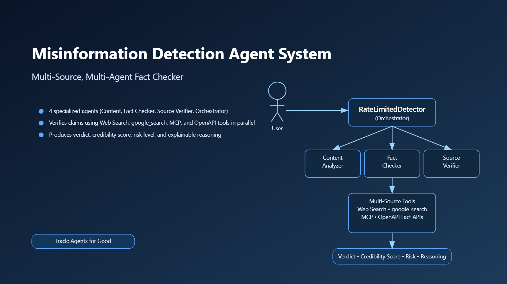

# 🛡️ Misinformation Detection Agent System

**Track**: Agents for Good  
**Problem**: Misinformation and Disinformation Detection  
**Solution**: Multi‑Agent AI System with Multi‑Source Verification and Interactive Evaluation UI  

Misinformation and disinformation are a growing risk for public health, climate action, and trust in institutions. This repository contains a **misinformation detection agent built with Gemini and the Google ADK**. The system analyzes content, extracts claims, checks those claims against several sources, scores the credibility of the publisher, and returns an **explainable verdict** with a credibility score and risk level.

 The main implementation is in `misinformation-detector-final-version-2.ipynb`

---

## 1. Problem & Motivation

Modern information ecosystems are flooded with **misleading or fabricated content**:

- False health claims.
- Climate denial and conspiracy theories.
- Misleading or cherry‑picked statistics.
- Fake or distorted government announcements.

Human fact‑checkers cannot realistically keep up, and most people don’t have time to do deep research on every post. We want an AI system that can:

1. Read a piece of content.
2. Extract specific verifiable claims.
3. Check those claims against high‑quality sources.
4. Evaluate the publisher’s track record.
5. Return a clear verdict with understandable reasoning.

---

## 2. Why Agents?

Misinformation detection is more than a single LLM call. It requires:

- **Content understanding** – what is actually being claimed?
- **Evidence gathering** – what do credible sources say?
- **Source assessment** – can we trust this publisher?
- **Decision synthesis** – how do we combine all of this into one verdict?

To address this, the system uses a **multi‑agent architecture**:

1. A **Content Analyzer Agent** to extract claims and emotional/bias signals.
2. A **Fact Checker Agent** to verify claims using four tools in parallel.
3. A **Source Verifier Agent** to score publisher credibility.
4. An **Orchestrator Agent** to synthesize a final verdict.

This architecture makes the solution:

- **Modular** – each agent has a clear responsibility and can be improved independently.
- **Explainable** – each step leaves a structured trace.
- **Extensible** – new tools (e.g., domain‑specific APIs) can be plugged into the Fact Checker.

---

## 3. Architecture Overview

### 3.1 High-Level Flow

User Content
   │
   ▼
Content Analyzer Agent  ──► Claims + emotional & bias signals
   │
   ├─────────► Source Verifier Agent (in parallel, if source URL provided)
   │
   └─────────► Fact Checker Agent
                  │
                  ├─ WebSearchTool (Custom Google Search)
                  ├─ ADK google_search (built-in)
                  ├─ MCP Fact Check Tool
                  └─ OpenAPI Fact Check Tool
   │
   ▼
Orchestrator Agent (RateLimitedDetector)
   ▼
Verdict + Credibility Score + Risk Level + Reasoning + Evidence Summary### 3.2 Core Detector

All orchestration is wrapped in a single class:

- **`RateLimitedDetector`**
  - Handles:
    - Session management (via `InMemorySessionService`).
    - Memory (`PatternLearningMemory`).
    - Parallel content & source analysis.
    - Parallel claim fact‑checking.
    - Context compaction for synthesis.
    - Rate limiting and retry logic.
  - Public API:
   
    result = await detector.analyze(content, source_url="optional_url")
    The returned `AnalysisResult` includes:

- `credibility_score` (0–1).
- `risk_level` (`LOW`/`MEDIUM`/`HIGH`).
- `verdict` (`TRUE`/`FALSE`/`MISLEADING`/`UNCERTAIN`).
- `confidence` (0–1).
- `reasoning` (short textual explanation).
- `content_analysis`, `fact_check_results`, `source_verification`.

---

## 4. Agents & Key Features

### 4.1 Content Analyzer Agent

- **Model**: `gemini-2.5-flash-lite`  
- **Role**:
  - Extract verifiable factual claims as a list of strings.
  - Detect emotional markers and sensationalism.
  - Identify bias indicators and key entities.
  - Estimate AI‑generation likelihood.
- **Output**: strictly formatted JSON, with robust post‑processing to repair malformed responses.

### 4.2 Fact Checker Agent (Multi-Source Verification)

- **Model**: `gemini-pro`.
- **Tools (in parallel)**:
  1. `WebSearchTool` – Custom Google Custom Search API integration.
  2. ADK’s built‑in `google_search` tool (when available).
  3. `MCPFactCheckTool` – Model Context Protocol fact‑check wrapper.
  4. `OpenAPIFactCheckTool` – OpenAPI 3.0‑style REST integration.
- **Responsibilities**:
  - For each claim, run all four sources in parallel.
  - Normalize and deduplicate evidence URLs.
  - Produce:
    - `verdict`, `confidence`, `reasoning`.
    - `evidence_sources` (trimmed URLs, human‑readable summaries).
    - `custom_search_findings`, `builtin_search_findings`, `mcp_findings`, `openapi_findings`.

### 4.3 Source Verifier Agent

- **Model**: `gemini-2.5-flash-lite`.  
- **Input**: `source_url` and optional content sample.  
- **Output**:
  - `credibility_level` (high/medium/low/unknown),
  - `reliability_score`,
  - `bias_score` (-1 to +1),
  - `red_flags`,
  - `positive_indicators`.

### 4.4 Orchestrator & Synthesis

- **Model**: `gemini-2.5-flash-lite`.  
- Receives compacted summaries from:
  - `content_analysis` (claims_count, sensationalism, bias_count, confidence).
  - `fact_summary` (true/false counts, avg confidence).
  - `source_summary` (credibility level, reliability score).
- **Heuristic for credible sources**:
  - When no explicit fact‑check hits exist but the source is **very high‑credibility** (e.g., WHO, NASA, .gov with high reliability), the orchestrator returns `TRUE` + `LOW` risk rather than `UNCERTAIN`.

---

## 5. Key ADK Concepts Demonstrated

The project makes use of the following ADK concepts:

1. **Multi-Agent System**  
   - 4 sub‑agents + orchestrator, combining parallel and sequential flows.

2. **Tools**  
   - Custom tool: `WebSearchTool`.
   - Built‑in tool: `google_search`.
   - MCP tools: `MCPFactCheckTool`, `MCPSourceTool`.
   - OpenAPI tool: `OpenAPIFactCheckTool`.

3. **Long-Running Operations**  
   - `LongRunningOperation` + `OperationManager` support pause/resume and checkpointing.

4. **Sessions & Memory**  
   - `InMemorySessionService` for session IDs.
   - `PatternLearningMemory` tracks patterns across analyses and aggregates source reliability.

5. **Context Engineering**  
   - `ContextCompactor` reduces context by 70–80% while preserving key signals.

6. **Observability & Performance Monitoring**  
   - `PerformanceMonitor` + `MonitoredMisinformationDetector` capture:
     - per‑component timings,
     - total durations,
     - error counts,
     - performance summary report.

7. **A2A Protocol (Agent-to-Agent Communication)**  
   - `A2AProtocol` and `A2AMessage` provide message‑based agent coordination.

8. **Deployment**  
   - FastAPI snippet with `/analyze` and `/health`.
   - Dockerfile for containerized deployment, suitable for Cloud Run.

---

## 6. Evaluation & Testing

### 6.1 Notebook Test Suite

The notebook includes:

- **Example 1** – “The Earth is flat and NASA has been hiding this fact…”  
  - Detected as misinformation with high risk and a MISLEADING/FALSE verdict.
- **Example 2** – Credible NASA content about Earth’s roundness.  
  - Detected as TRUE with higher credibility, especially when given a NASA URL.

### 6.2 Extended 8-Scenario Suite

- Medical misinformation (vaccines/autism).
- Climate change denial.
- Credible scientific content (Nature / WHO / Science).
- Misleading cherry‑picked facts.
- Conspiracy theories (moon landing).
- Credible health information (WHO smallpox eradication).
- Financial scam‑style messaging.
- Credible technology news.

Each run prints:

- Credibility score, risk level, verdict, confidence.
- Reasoning.
- Number of claims extracted.
- Per‑claim fact‑check verdicts and confidences.
- A **TEST SUMMARY** table across all scenarios.

### 6.3 Scenario Pack for Citations

A dedicated cell runs a **scenario pack** of real‑world statements, including recent U.S. government announcements and public health facts, to verify that:

- TRUE claims from high‑credibility sources produce TRUE + LOW risk verdicts.
- Citations from evidence sources are surfaced when available.

---

## 7. Interactive ADK Web UI

The project also integrates with the **ADK Web UI**:

- Defines an app (`misinformation_detector_app`) with a `root_agent` that always calls a `MisinformationDetectionTool`, which wraps `RateLimitedDetector`.
- Supports:
  - interactive chat,
  - trace visualization,
  - creation of evaluation sets from sessions,
  - running evaluations with metrics like Response Match Score and Tool Trajectory Score.

This provides a **visual, interactive way** to explore the agent’s behavior and create regression tests for key cases.

---

## 8. Deployment

### 8.1 FastAPI API

- `POST /analyze` – accepts `content` and optional `source_url`, returns credibility score, risk level, verdict, reasoning, and confidence.
- `GET /health` – simple health check.

### 8.2 Docker & Cloud Run

- Dockerfile:
  - Python 3.11 slim base.
  - Installs requirements and runs `uvicorn` on port 8080.
- This is suitable for deployment to **Google Cloud Run** or any container host.

---

## 9. How to Run (High Level)

1. **In Notebook**
  
   detector = RateLimitedDetector()
   result = await detector.analyze(
       content="Your content to analyze here",
       source_url="https://optional-source-url.com"
   )
   print(result.verdict, result.credibility_score, result.reasoning)
   2. **Via FastAPI (once deployed)**
   - `POST /analyze` with JSON body:
    
     { "content": "text to analyze", "source_url": "https://optional-source.com" }
     3. **In ADK Web UI**
   - Run `adk web` from the project directory.
   - Open the proxied URL.
   - Select the `misinformation_detector` app.
   - Type:  
     “Analyze the following content for misinformation: ‘The Earth is flat and NASA has been hiding this fact.’”
   - Inspect the trace and evaluation tools.

---

## 10. Submission Summary

- **Track**: Agents for Good  
- **Problem**: Misinformation and Disinformation Detection  
- **Solution**: Multi‑Agent AI System with Multi‑Source Verification and Interactive Evaluation UI  
- **Concepts Demonstrated**: Multi‑agent architecture, four tool categories, long‑running operations, sessions & memory, context engineering, observability, A2A protocol, deployment.

In short, this is a practical, end‑to‑end example of how to use agents, tools, and Gemini to reason about the credibility of online content.
